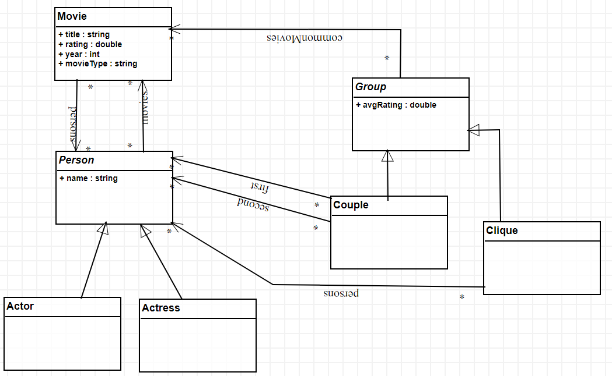

You should install ATomPM for this exercise: [Install](../AToMPM&#32;Installation.md)

### Create a metamodel

*   Open a new instance of AToMPM
*   Load the toolbar: **/Formalisms/__LanguageSyntax__/SimpleClassDiagram/SimpleClassDiagram.umlIcons.metamodel**
*   Design the metamodel
*   Save the metamodel file: **/Formalisms/IMDB/IMDB_MM.model**

### Create concrete syntax

*   Open a new instance of AToMPM
*   Load the toolbar: **/Formalisms/__LanguageSyntax__/ConcreteSyntax/ConcreteSyntax.defaultIcons.metamodel**
*   Design an visual syntax for each of the "non-abstract" classes and links.
*   The name of the icons for classes should be: {NameOfTheClass}Icon
*   The name of the icons for links should be: {NameOfTheLink}Link
*   Save the visual concrete syntax file: **/Formalisms/IMDB/IMDB_MM.defaultIcons.model**

### Generate the modeling environment

*   Compile the metamodel
    *   Go to your metamodel
        *   Either go to the tab that it is open
        *   Or open the **IMDB_MM.model** file in a new AToMPM instance
    *   Click "Compile current model into an abstract syntax metamodel" icon
        *   
    *   Write a new file name in the same folder (**/Formalisms/IMDB**)
        *   **IMDB_MM.metamodel**
*   Compile the concrete syntax model
    *   Go to your concrete syntax file
        *   Either go to the tab that it is open
        *   Or open the **IMDB_MM.defaultIcons.model** file in a new AToMPM instance
    *   Click "compile current model into an icon definition metamodel" icon
        *   
    *   Write a new file name in the same folder (**/Formalisms/IMDB**)
        *   **IMDB_MM.defaultIcons.metamodel**

### Create model instances

*   Open a new instance of AToMPM
*   Load the toolbar: **/Formalisms/IMDB/IMDB_MM.defaultIcons.metamodel**
*   Create this movie: [https://www.imdb.com/title/tt0111161/](https://www.imdb.com/title/tt0111161/) 

### BONUS

*   Add a new attribute to the Movie class called poster.
*   Make this poster the concrete syntax of the Movie

### Some AToMPM practices

*   To create anything from a toolbar
    *   Left-click on the icon in the toolbar
    *   Right-click on an empty place on the canvas
*   To enter property editor
    *   Select the element in the canvas
    *   Press "ins" key on the keyboard
    *   OR middle-click on the mouse
*   To create a link between elements.
    *   Unselect all elements
    *   Then right-click from any icon you want
    *   And drag mouse over another icon
*   Map the real attribute value to the concrete syntax:
    *   Add this to the mapper part of any drawing: 
    *   ({'textContent':getAttr('name')})
    *   _textContent_ is the name of the attribute in the visual drawing
    *   _name_ is the name of the real attribute in the metamodel
